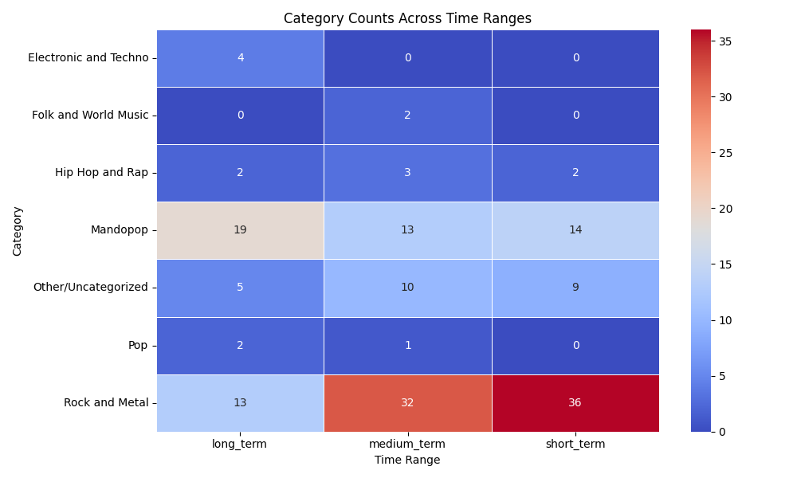

# Spotify Tracker

Spotify Tracker is a lightweight script that helps you track your daily Spotify listening habits and analyze how your music preferences evolve over time. With easy-to-generate insights, you can explore trends in genres, artists, and albums you enjoy.

This project leverages the [Spotipy library](https://spotipy.readthedocs.io/en/2.16.1/), which connects your local environment to the Spotify API, enabling seamless access to your listening data.

## Features

- **Track Recent Songs**: Retrieves the last 50 songs you've played on Spotify.
- **Persistent History**: Appends new tracks to an Excel file while avoiding duplicates based on the "Played at" timestamp.
- **Weekly and Yearly Analysis**: Generates top songs, albums, and artists for the current week or year.
- **Genre Trends**: Provides a breakdown of genres you listen to across short (4 weeks), medium (6 months), and long (1 year) timeframes.

### Limitations

The Spotify API only allows access to your most recent 50 songs. To maintain a complete listening history, you need to run the script periodically. Automating this process is recommended for the best results.

## Setup and Usage

To use Spotify Tracker, follow these steps:

1. **Spotify Developer Account**:
   - Create a developer account and an app on the [Spotify Developer Dashboard](https://developer.spotify.com/dashboard/applications).
   - Obtain your **Client ID** and **Client Secret**.
   - Set up a Redirect URI (e.g., `http://localhost:8888/callback`).

2. **Environment Setup**:
   - Install dependencies using `pip install -r requirements.txt`.

3. **Run the Scripts**:
   - Use `daily_tracker.py` to fetch and save your most recent listening history.
   - Optionally, explore weekly and yearly trends with `top_week.py` and `top_year.py`.
   - Analyze genre trends with `genres_analysis.py`.

## Folder Structure

The project includes four main modules:

- **`daily_tracker.py`**: The primary script to fetch and append your latest listening history to an Excel file.
- **`top_week.py`**: Analyzes the top songs, albums, and artists for the current week.
- **`top_year.py`**: Extends the analysis to the current year.
- **`genres_analysis.py`**: Examines genre trends across short, medium, and long timeframes, providing insightful visualizations.

## Example Graphs

### Genre Heatmap

A heatmap illustrating the distribution of genres over short, medium, and long-term periods:

## Future Improvements

- Automate the script to run periodically, ensuring complete listening history.
- Expand analysis capabilities to include more custom insights.

## Contact

Feel free to reach out for questions or suggestions. Happy tracking!

